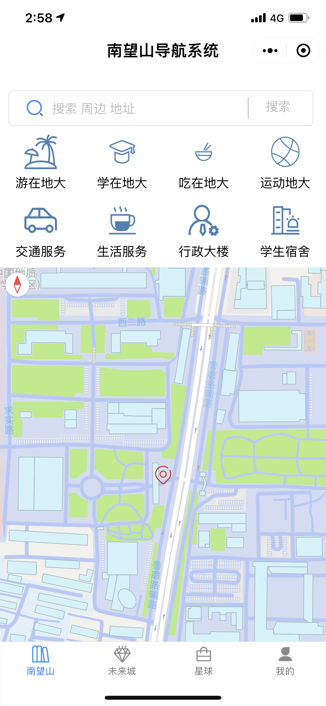
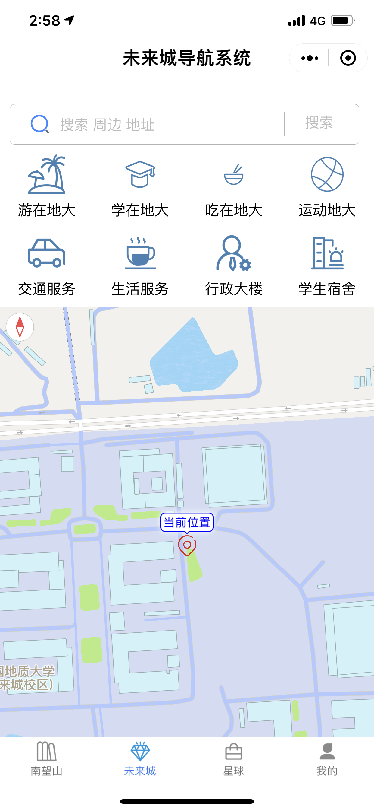
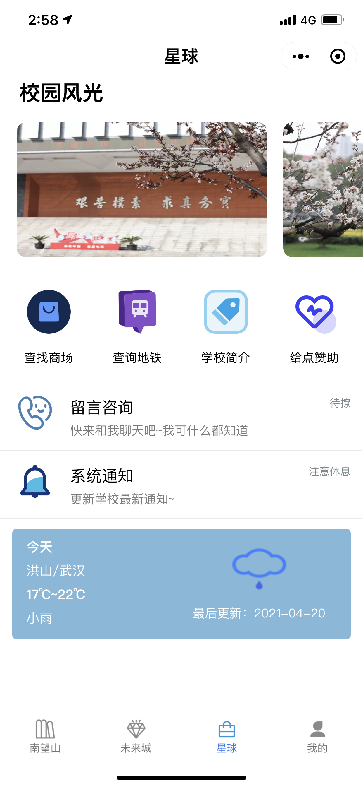

# CUG_Campus-navigation
### 体验可前往微信小程序搜索：地大校园导航
### 中国地质大学（武汉）南望山、未来城校区微信小程序校园导航，使用的是腾讯地图接口和插件，所以不具备技术性，纯属娱乐，不喜勿喷。
### 视频展示：
https://www.bilibili.com/video/BV1tp4y1t7Fx
### 项目文件结构
    CUG_Campus-navigation
    ├── pages
    │   ├── home
    │   │   ├── home.js
    │   │   ├── home.json
    │   │   ├── home.wxml
    │   │   ├── home.wxss
    │   ├── home2
    │   │   ├── home2.js
    │   │   ├── home2.json
    │   │   ├── home2.wxml
    │   │   ├── home2.wxss
    ├── utils
    ├── app.js
    ├── app.json
    ├── app.wxss
    ├── project.config.json
    ├── qqmap-wx-jssdk.js
## 🐱‍🏍项目效果

  
   

  
   

本项目只包含实验结果中的图1、2，由于依赖腾讯位置服务，具体是在腾讯位置服务中申请自己的key，代码中key对应的位置我已经标记，只需要找到替换成自己的key就行，另外，可能某些功能还需要在项目中添加一些插件，如果要改成其他地方的导航，位置信息和标记点需要更换，如果使用，请备注项目来源，欢迎与我交流~

